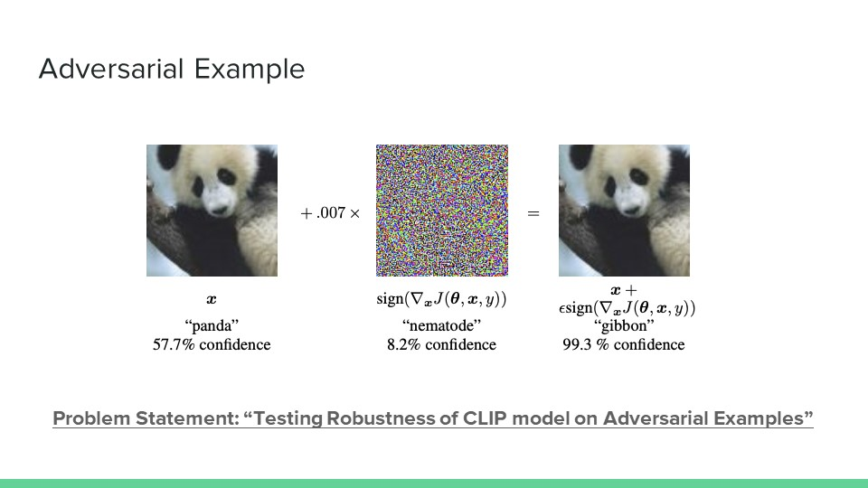
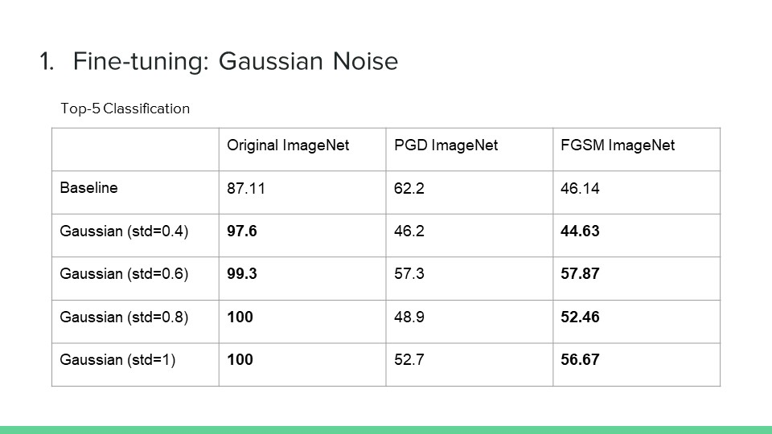
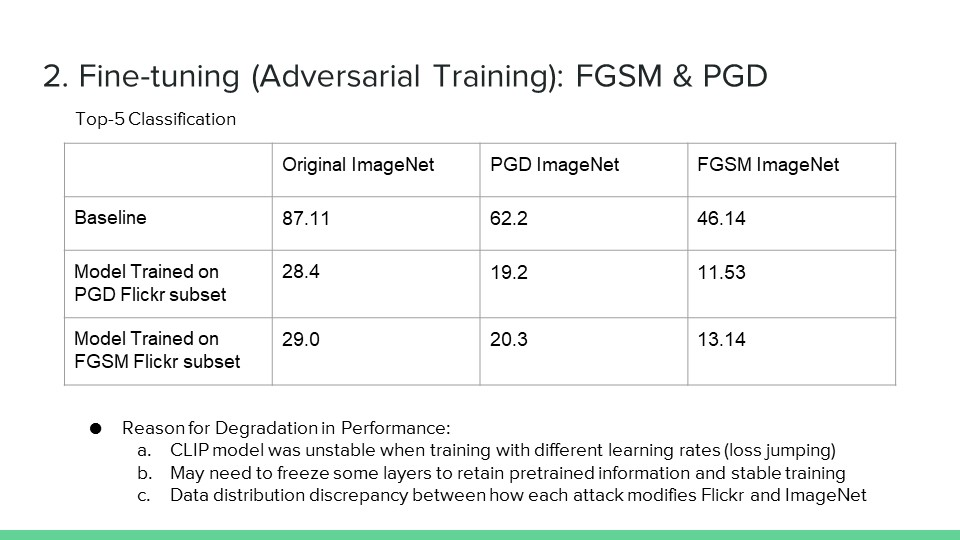

# Final Project: Assessing CLIP Robustness on Adversarial Attacks
- COMS6998 Practical Deep Learning System Performance (Fall 2022, Prof. Parijat Dube)
- Coauthors: Chaewon (Emily) Park, Hnin Ookhin

## Project and Repo Description

<p align="center">
  
</p>

Adversarial images are images which have very small, indistinguishable  perturbations that causes misclassifications by ML models.
The perturbations are calculated by taking the gradient with respect to the image and the pixels are modified in the gradient direction that maximizes the loss.

We generated adversarial examples using FGSM and PGD attacks, on both ImageNet and Flickr data subset.
Using the adversarial examples, we performed inference using top-k accuracy to assess robustness.
Furthermore, we conducted two experiments using Gaussian noise and adversarial training to improve robustness.

## Library Requirements 

We will be using OpenAI's CLIP model from here: https://github.com/openai/CLIP. 

In order to use CLIP, we will need to install the following libraries. 

```
$ conda install --yes -c pytorch pytorch=1.7.1 torchvision cudatoolkit=11.0
$ pip install ftfy regex tqdm pandas
$ pip install git+https://github.com/openai/CLIP.git
```

## Datasets 
Datasets used in this project can be downloaded here: https://drive.google.com/drive/u/0/folders/1zMM6bucw00lVANaxTG6a-S1OR9lHKnNX
- Can only be accessed using Columbia Lion email account
- These should all be placed in `./data/` folder.
- There are two datasets: ImageNet (subset of size 1000) and Flickr, which will be used for inference and to generate adversarial examples.

## Models
Models used in this project (Gaussian noise models, adversarially trained models) can be downloaded here: https://drive.google.com/drive/u/0/folders/1zMM6bucw00lVANaxTG6a-S1OR9lHKnNX
- Can only be accessed using Columbia Lion email account
- Should be placed in the same location as the .ipynb files

## Inference 
For inference and cacluating top-k metric presented, please refer to `OpenAIClIP_ZeroShot_Inference.ipynb.`

## Results and Observation
* Experiment 1: Gaussian Noise

<p align="center">
  
</p>

* Experiment 2: Adversarial Training

<p align="center">
  
</p>

## Observation:

- Gaussian noise showed promising results in improving model robustness, but we may need to probe for better hyper-parameter settings
- Adversarial training showed performance degradation which is expected to be overcome by freezing the appropriate subset of layers to stabilize training
- More data augmentations (Poisson, salt and pepper noise, cut-outs) and regularization techniques(drop-out, skip connections) are anticipated to produce better robustness

